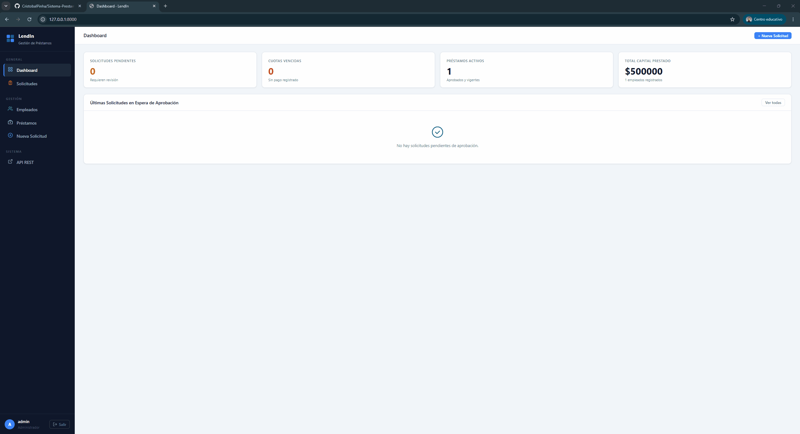
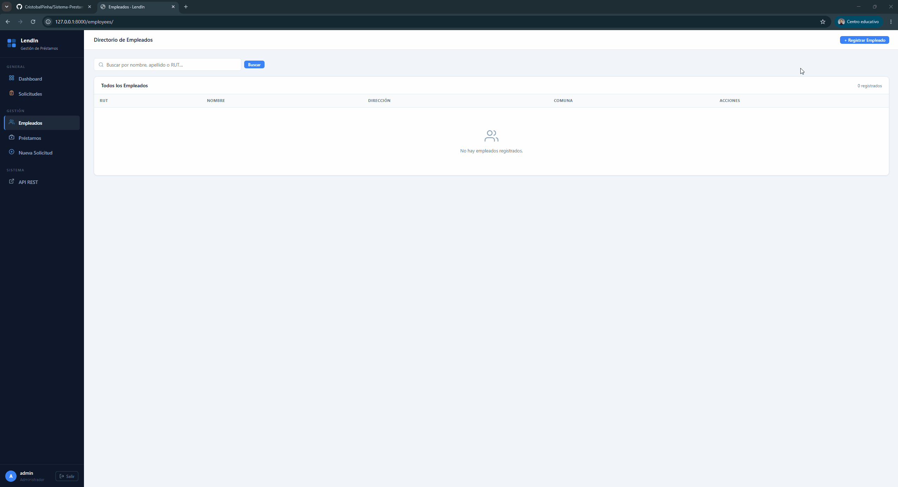
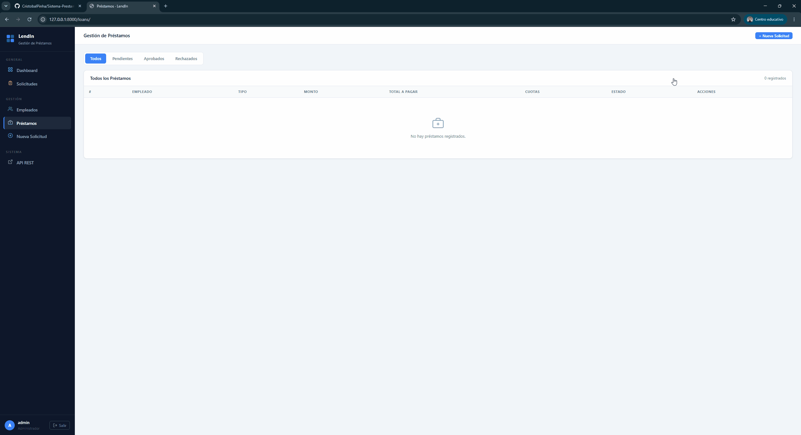

# LendIn

> Plataforma web para gestionar préstamos otorgados a empleados de una organización. Incluye panel administrativo con dashboard, flujo de aprobación, seguimiento de cuotas y API REST.

---

## Índice

- [Demo](#demo)
- [Funcionalidades](#funcionalidades)
- [API REST](#api-rest)
- [Tests](#tests)
- [Instalación](#instalación)
- [Base de datos](#base-de-datos)
- [Estructura del proyecto](#estructura-del-proyecto)

---

## Demo

**Login y dashboard**
Acceso restringido con redirección automática al intentar entrar sin sesión.

**Gestión de empleados**
Registro con validación de RUT chileno y búsqueda en tiempo real.

**Flujo de préstamos**
Solicitud → aprobación → generación automática de cuotas.

**API REST**
Endpoints navegables con Django REST Framework.

---

## Funcionalidades

| Módulo | Descripción |
|--------|-------------|
| **Dashboard** | Métricas en tiempo real: solicitudes pendientes, cuotas vencidas, préstamos activos y capital total |
| **Empleados** | CRUD con validación de RUT chileno (Módulo 11) y 35 comunas precargadas |
| **Préstamos** | Flujo pendiente → aprobado/rechazado con generación automática de cuotas |
| **Cuotas** | Estado calculado en tiempo real (Pagada / Al día / Vencida), exportación a Excel y PDF |
| **Autenticación** | Acceso restringido, login con diseño propio, gestión de usuarios desde `/admin/` |
| **Búsqueda** | Empleados por nombre/RUT, préstamos por estado, paginación de 10 registros |
| **API REST** | Endpoints completos bajo `/api/` con interfaz navegable de DRF |

---

## API REST

| Método | Endpoint | Descripción |
|--------|----------|-------------|
| \`GET\` | \`/api/empleados/\` | Lista todos los empleados |
| \`GET\` \`PUT\` \`DELETE\` | \`/api/empleados/{rut}/\` | Detalle, editar o eliminar |
| \`POST\` | \`/api/empleados/\` | Crear empleado |
| \`GET\` | \`/api/prestamos/\` | Lista todos los préstamos |
| \`GET\` \`DELETE\` | \`/api/prestamos/{id}/\` | Detalle con cuotas o eliminar |
| \`POST\` | \`/api/prestamos/\` | Crear préstamo |
| \`GET\` | \`/api/prestamos/{id}/cuotas/\` | Cuotas de un préstamo |
| \`GET\` | \`/api/tipos-prestamo/\` | Lista tipos de préstamo |
| \`GET\` | \`/api/comunas/\` | Lista comunas |

Interfaz navegable en \`http://127.0.0.1:8000/api/\`

---

## Tests

26 tests automatizados organizados en 6 grupos.

\`\`\`bash
python manage.py test myapp --verbosity=2
\`\`\`

| Grupo | Tests | Qué verifica |
|-------|:-----:|--------------|
| \`ValidarRutTest\` | 8 | Formato y dígito verificador del RUT |
| \`EstadoCuotaTest\` | 3 | Estados Pagada / Vencida / Al día |
| \`PrestamoCalculoTest\` | 3 | Cálculo del monto total con interés |
| \`GenerarCuotasTest\` | 5 | Cantidad, montos, fechas y numeración |
| \`EmpleadoAPITest\` | 4 | Endpoints de empleados |
| \`PrestamoAPITest\` | 3 | Endpoints de préstamos y cuotas |

**Validación de RUT** — acepta con o sin puntos, normaliza \`k\` a \`K\`:

\`\`\`
Válido:   12345678-9      Válido:   12.345.678-9      Válido:   19654321-K
Inválido: 123456789       Inválido: 12345678-X         Inválido: 12345678-5
\`\`\`

---

## Instalación

### Con Docker

Requiere [Docker Desktop](https://www.docker.com/products/docker-desktop/).

\`\`\`bash
# 1. Configurar variables de entorno
cp .env.example .env   # editar SECRET_KEY y DB_PASSWORD

# 2. Levantar
docker compose up

# 3. Apagar
docker compose down
\`\`\`

La app queda en \`http://127.0.0.1:8000\`. Migraciones y datos iniciales se aplican automáticamente.

### Sin Docker

**Requisitos:** Python 3.10+ · MySQL 8.0+

\`\`\`powershell
# Entorno virtual
python -m venv venvPE
.\venvPE\Scripts\Activate.ps1

# Dependencias
pip install -r requirements.txt

# Base de datos
# Crear en MySQL: prestamos_empleados (utf8mb4)

# Variables de entorno
# SECRET_KEY, DB_PASSWORD, DB_HOST=localhost

# Migraciones y servidor
python manage.py migrate
python manage.py createsuperuser
python manage.py runserver
\`\`\`

---

## Base de datos

\`\`\`mermaid
classDiagram
    direction LR

    class Comuna {
        +int id_comuna
        +string nombre_comuna
    }

    class Empleado {
        +string RUT_empleado
        +string nombre_empleado
        +string apellido_empleado
        +string direccion_empleado
    }

    class TipoPrestamo {
        +int id_tipo_prestamo
        +string tipo_prestamo
        +int tasa_de_interes
    }

    class Prestamo {
        +int id_prestamo
        +int monto_prestamo
        +int monto_pagar
        +int cantidad_cuotas
        +string estado
    }

    class Cuota {
        +int id_cuota
        +int numero_cuota
        +int monto_cuota
        +datetime fecha_vencimiento
        +datetime fecha_pago
    }

    Comuna "1" --> "N" Empleado : tiene
    Empleado "1" --> "N" Prestamo : solicita
    TipoPrestamo "1" --> "N" Prestamo : clasifica
    Prestamo "1" --> "N" Cuota : genera
\`\`\`

---

## Estructura del proyecto

\`\`\`
LendIn/
├── Dockerfile
├── docker-compose.yml
├── requirements.txt
├── mysite/
│   ├── settings.py
│   └── urls.py
└── myapp/
    ├── models.py              # Empleado, Prestamo, Cuota, TipoPrestamo, Comuna
    ├── views.py               # Vistas web, API y exportación
    ├── serializers.py         # Serializers DRF
    ├── forms.py               # Validación de RUT
    ├── services.py            # Generación de cuotas
    ├── context_processors.py  # Badge de pendientes en sidebar
    ├── migrations/            # Datos iniciales de comunas y tipos
    ├── templates/
    │   ├── admin/             # Admin personalizado
    │   ├── registration/      # Login
    │   └── *.html
    └── static/myapp/css/
        ├── styles.css         # Diseño principal
        └── admin.css          # Estilos del panel admin
\`\`\`
